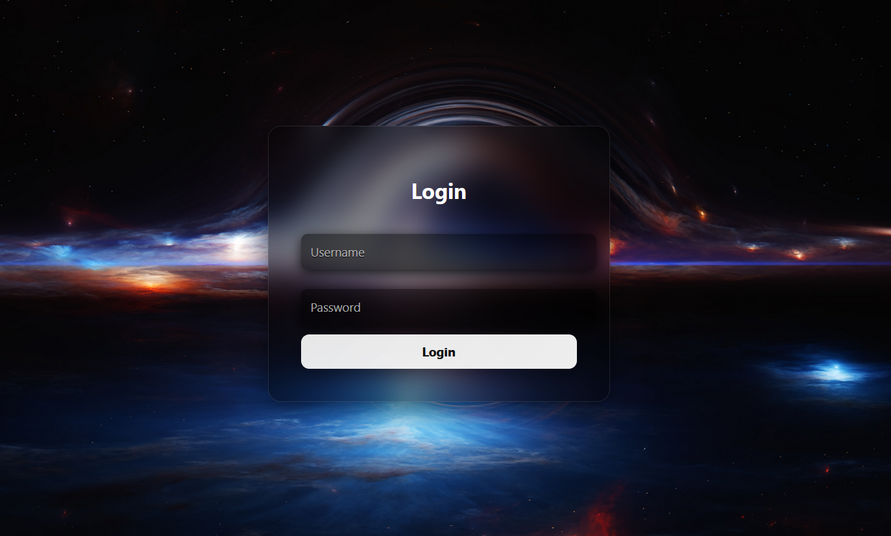
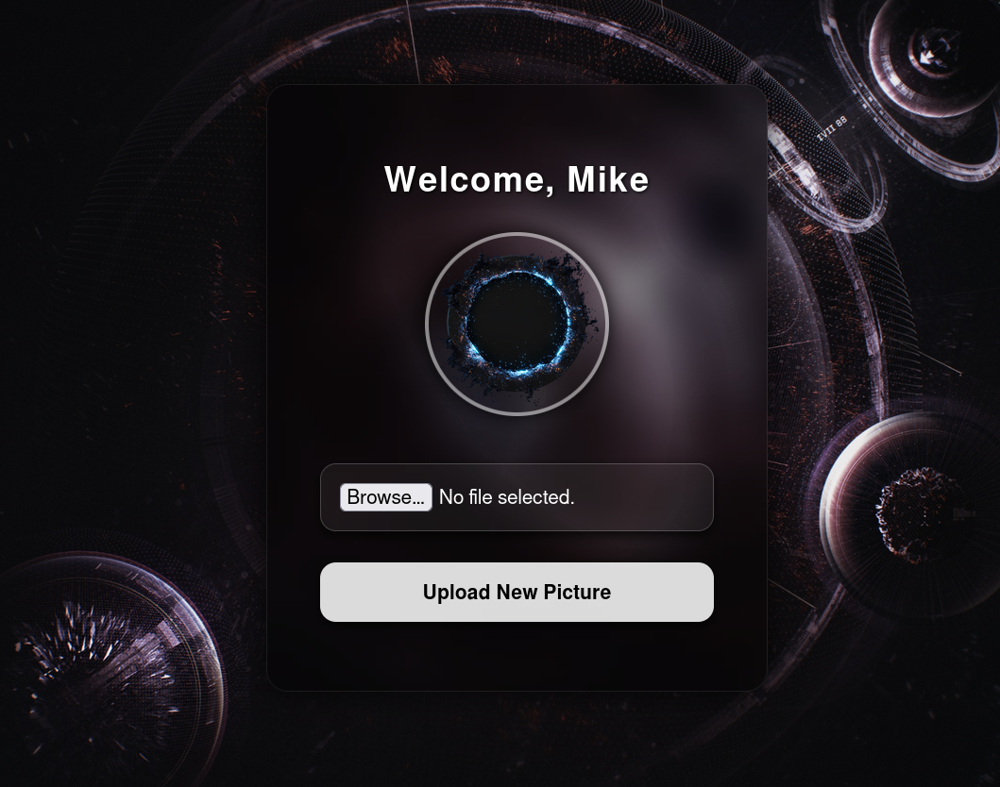

# BlackHole CTF

## Screenshots

| Login Page | Upload Portal | Root Access |
|------------|---------------|-------------|
|  |  |  |

> Add your screenshots in the `screenshots/` folder

---


> *"Not everything that falls into the blackhole is lost — some find their way through."*

BlackHole is a custom-built Boot2Root CTF machine designed to simulate realistic
cybersecurity attack scenarios. Built on Debian 12, it challenges players across
multiple layers — web, network, and system — making it a complete hands-on
experience for offensive security practitioners.

The machine features a deceptive architecture with honeypot login pages, hidden
virtual hosts, exposed git credentials, a file upload vulnerability, and a stealth
internal service only reachable via SSH tunneling — all chained together to reach root.

---

## 📥 Download

| Platform | Link |
|----------|------|
| ☁️ Google Drive | [Download BlackHole.ova](https://drive.google.com/file/d/1Jo-Rcw6siC602B160DVo7afT-Y0DNh6A/view?usp=sharing) |

> ⚠️ File Size: ~2.68 GB — Use in VMware or VirtualBox only

---

## 📋 Machine Info

| Detail | Info |
|--------|------|
| 🖥️ Name | BlackHole: 1 |
| 👤 Author | Mithun Jana |
| 🐧 OS | Debian 12 |
| 🌐 Network | DHCP |
| 🏴 Flags | user.txt + root.txt |
| ⚔️ Difficulty | Medium |
| 🛠️ Virtualization | VMware / VirtualBox |

---

## 🎯 Description

BlackHole simulates a real-world vulnerable web server environment with multiple
layers of deception. The machine is built to test and improve offensive security
skills covering web exploitation, credential harvesting, internal network pivoting,
and privilege escalation.

Key elements include a login honeypot that logs attacker credentials, a hidden
`.git` directory with misconfigured permissions leaking sensitive data, a fake
web application with a file upload vulnerability, and a stealth internal service
invisible to standard enumeration — accessible only via SSH port forwarding.

---

## 🧠 Skills Required

- Web enumeration & directory brute-forcing
- Git repository exposure exploitation
- Virtual host (vhost) enumeration
- File upload restriction bypass
- Burp Suite request interception
- PHP reverse shell
- SSH port forwarding & tunneling
- Internal service exploitation (crontab-ui)
- Cron job abuse for privilege escalation

---

## 🗺️ Attack Path Overview

```
🌐 Web Recon
     ↓
📁 Hidden /.git/ Directory Found (dirsearch)
     ↓
🔑 Credentials Leaked (git-dumper → config_backup.php)
     ↓
🌍 vHost Enumeration (ffuf → portal.blackhole.local)
     ↓
📤 File Upload Bypass (double extension via Burp Suite)
     ↓
🐚 PHP Reverse Shell → Initial Foothold (www-data)
     ↓
📧 Credential Found in Mail → SSH Login
     ↓
🏴 user.txt captured
     ↓
🔌 SSH Port Forwarding → Internal Service (port 8000)
     ↓
⏰ Crontab-UI Abuse → Root Reverse Shell
     ↓
🚩 root.txt captured
```

---

## ⚙️ Setup Instructions

### Requirements
- VMware Workstation / VirtualBox
- Kali Linux or any pentesting distro as attacker machine
- Network set to **NAT** or **Host-Only**

### Steps

**1. Import the VM**
```bash
# VirtualBox: File → Import Appliance → select .ova
# VMware: File → Open → select .ova
```

**2. Boot the VM**
- VM will automatically get an IP via DHCP

**3. Find the Target IP**
```bash
netdiscover -r 192.168.x.0/24
# or
arp-scan -l
```

**4. Add to /etc/hosts**
```bash
echo "TARGET_IP  blackhole.local" | sudo tee -a /etc/hosts
```

**5. Start Hacking! 🎯**
```bash
# Open in browser
http://blackhole.local
```

---

## 🛠️ Technology Stack

| Component | Role |
|-----------|------|
| Debian 12 | Base operating system |
| Apache2 | Hosts virtual hosts (blackhole.local / portal.blackhole.local) |
| PHP | Login panels and backend scripts |
| Node.js | Runs internal cron panel (hidden service) |
| crontab-ui | Hidden internal web service on port 8000 |
| SSH | Shell access and port forwarding tunnel |
| Git | Hidden `.git` directory with leaked credentials |

---

## 📄 Full Report

Complete development report including system architecture, source code,
full walkthrough, and screenshots:

👉 **[View CTF Report (PDF)](./CTF_REPORT.pdf)**

---

## 🚩 Flags

| Flag | Location | Preview |
|------|----------|---------|
| User Flag | `~/user.txt` | `flag{us3r_m1ke_**********************}` |
| Root Flag | `/root/root.txt` | `flag{bl4ckh0l3_**********************}` |

---

## ⚠️ Disclaimer

This CTF machine is created **solely for educational and research purposes**.
It is designed to help cybersecurity enthusiasts practice ethical hacking,
vulnerability assessment, and penetration testing in a **controlled environment**.

- ❌ Do NOT deploy on public networks
- ❌ Do NOT use against systems without authorization
- ✅ Use only in an isolated virtual environment

The author takes no responsibility for misuse of techniques demonstrated in this challenge.

---

## 👤 Author

**Mithun Jana**

> *"Built with passion for the cybersecurity community"*

---

⭐ If you enjoyed this CTF, consider giving this repo a star!
